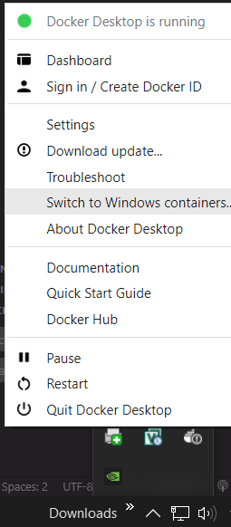

# CSI Assessment

## About

A little project to showcase certain skills in development, like utilizing Node and Docker.

## Getting Started

Docker is a required dependency that you will need setup. (https://www.docker.com/get-started/)

Once you have Docker setup you can either manually build and run this program... or utilitze the scripts provided for you in package.json (recommended).

## Usage

Windows Containers:
`npm run docker:windows`

Linux Containers:
`npm run docker:linux`

## Troubleshooting

You may run into issues with pulling the correct Docker image. I've provided a dockerfile for both windows and linux. You can optionally change which containers you are pulling from by switching container options in Docker. I do this by toggling my hidden icons in the taskbar, right-clicking the Docker Desktop icon, and selecting Switch to (Windows/Linux) Containers.

## Steps taken to complete challenge:

- Read through spec
- Research unknowns from spec (e.g. ISO speeds)
- Clarify unknowns from spec with client (e.g. "reverse" order, initially I thought I would need to ask, but after seeing the folder's initial file structure sorted, I understood I was supposed flip the order)
- Identify requirements (e.g. Download zip, extract zip, etc...)
- Implement requirements
